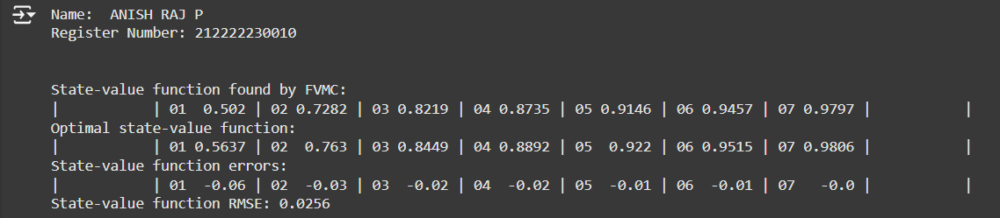
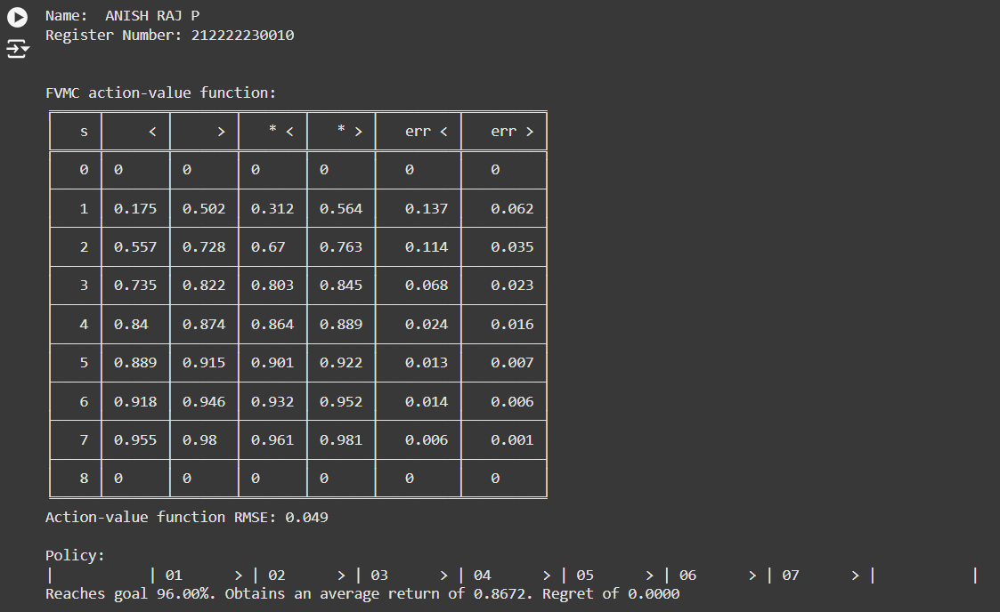
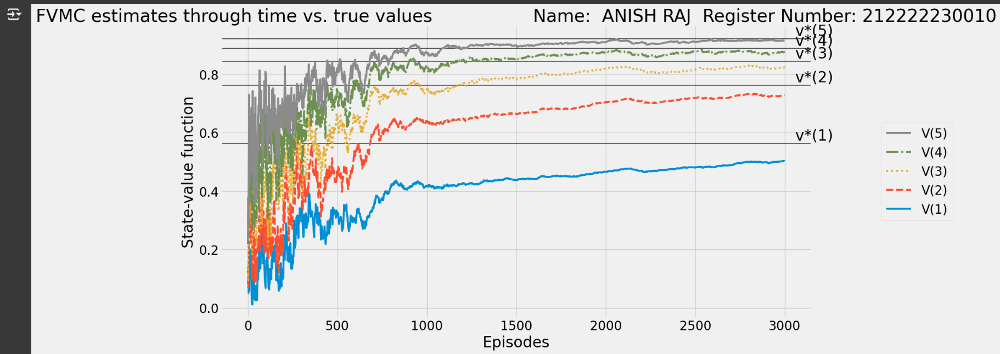
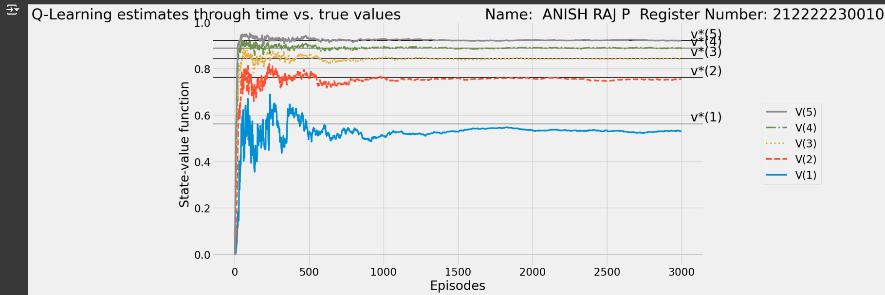

# Q Learning Algorithm


## AIM
To develop a Python program to find the optimal policy for the given RL environment using Q-Learning and compare the state values with the Monte Carlo method.

## PROBLEM STATEMENT
The goal is to implement a Q-learning algorithm for training a reinforcement learning agent in a given environment. The agent should use an epsilon-greedy strategy for action selection, balancing exploration and exploitation. Implement decay schedules for the learning rate (alpha) and exploration rate (epsilon) over episodes. Track the evolution of the Q-values and the learned policy across episodes. Evaluate the agent's performance across multiple random seeds, computing the average Q-values, value function, and policy to assess the stability and effectiveness of the learning process.
## Q LEARNING ALGORITHM

### Step 1:
Initialize Q-table and hyperparameters.
### Step 2:
Choose an action using the epsilon-greedy policy and execute the action, observe the next state, reward, and update Q-values and repeat until episode ends.
### Step 3:
After training, derive the optimal policy from the Q-table.
### Step 4:
Implement the Monte Carlo method to estimate state values.
### Step 5:
Compare Q-Learning policy and state values with Monte Carlo results for the given RL environment.

## Q LEARNING FUNCTION
```
 Name:   ANISH RAJ P
 Register Number : 212222230010

def q_learning(env,
               gamma=1.0,
               init_alpha=0.5,
               min_alpha=0.01,
               alpha_decay_ratio=0.5,
               init_epsilon=1.0,
               min_epsilon=0.1,
               epsilon_decay_ratio=0.9,
               n_episodes=3000):
    nS, nA = env.observation_space.n, env.action_space.n
    pi_track = []
    Q = np.zeros((nS, nA), dtype=np.float64)
    Q_track = np.zeros((n_episodes, nS, nA), dtype=np.float64)
    select_action=lambda state,Q,epsilon: np.argmax(Q[state]) if np.random.random()>epsilon else np.random.randint(len(Q[state]))
    alphas=decay_schedule(
        init_alpha,min_alpha,
        alpha_decay_ratio,
        n_episodes)
    epsilons=decay_schedule(
        init_epsilon,min_epsilon,
        epsilon_decay_ratio,
        n_episodes)
    for e in tqdm(range(n_episodes),leave=False):
      state,done=env.reset(),False
      action=select_action(state,Q,epsilons[e])
      while not done:
        action=select_action(state,Q,epsilons[e])
        next_state,reward,done,_=env.step(action)
        td_target=reward+gamma*Q[next_state].max()*(not done)
        td_error=td_target-Q[state][action]
        Q[state][action]=Q[state][action]+alphas[e]*td_error
        state=next_state
      Q_track[e]=Q
      pi_track.append(np.argmax(Q,axis=1))
    V=np.max(Q,axis=1)
    pi=lambda s:{s:a for s,a in enumerate(np.argmax(Q,axis=1))}[s]
    return Q, V, pi, Q_track, pi_track
```

## OUTPUT:

### Optimal State Value Functions:


### Optimal Action Value Functions:



### State value functions of Monte Carlo method:



### State value functions of Qlearning method:



## RESULT:

Thus, Q-Learning outperformed Monte Carlo in finding the optimal policy and state values for the RL problem.
